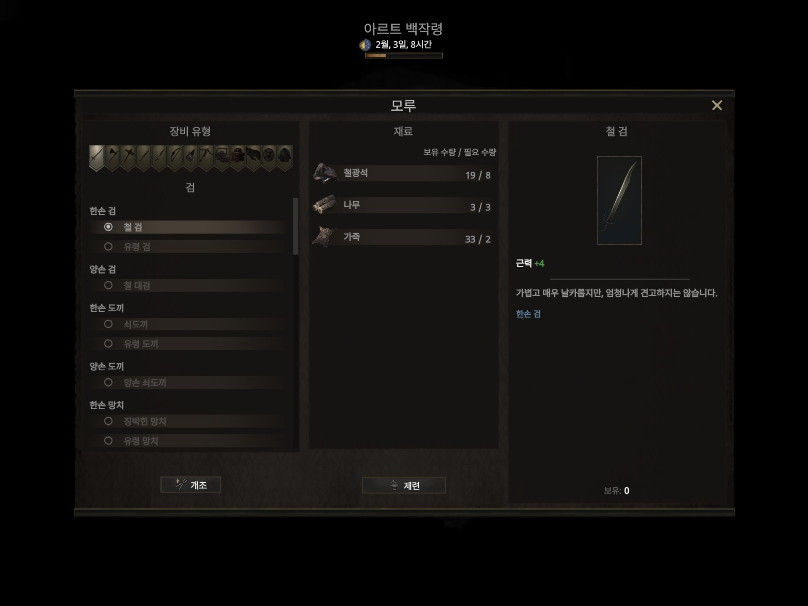
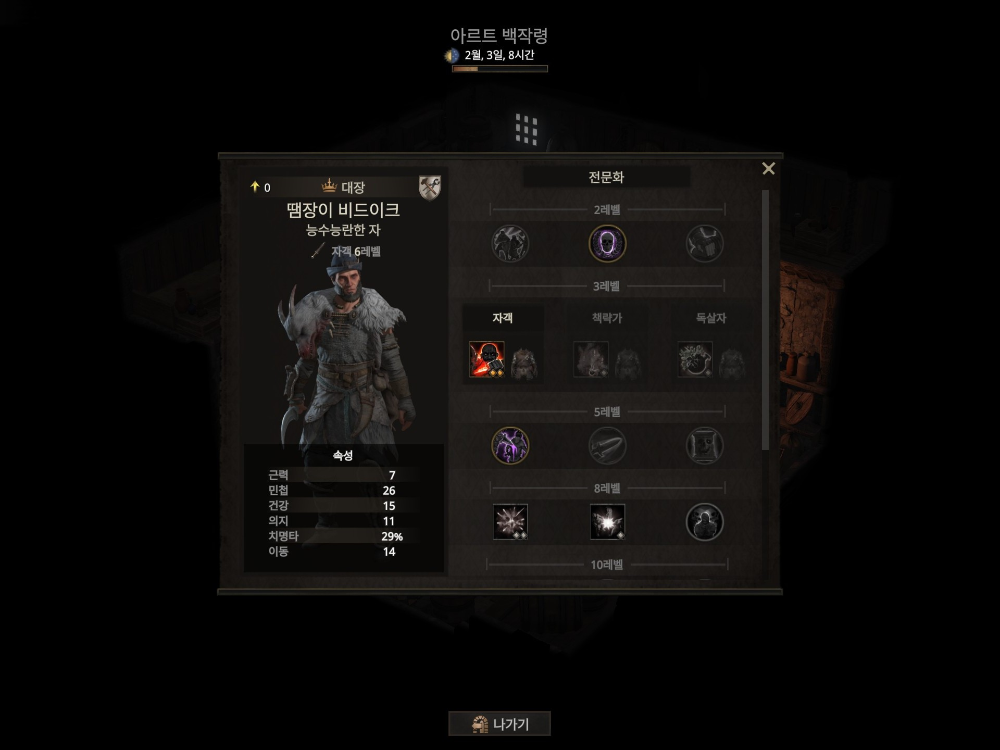
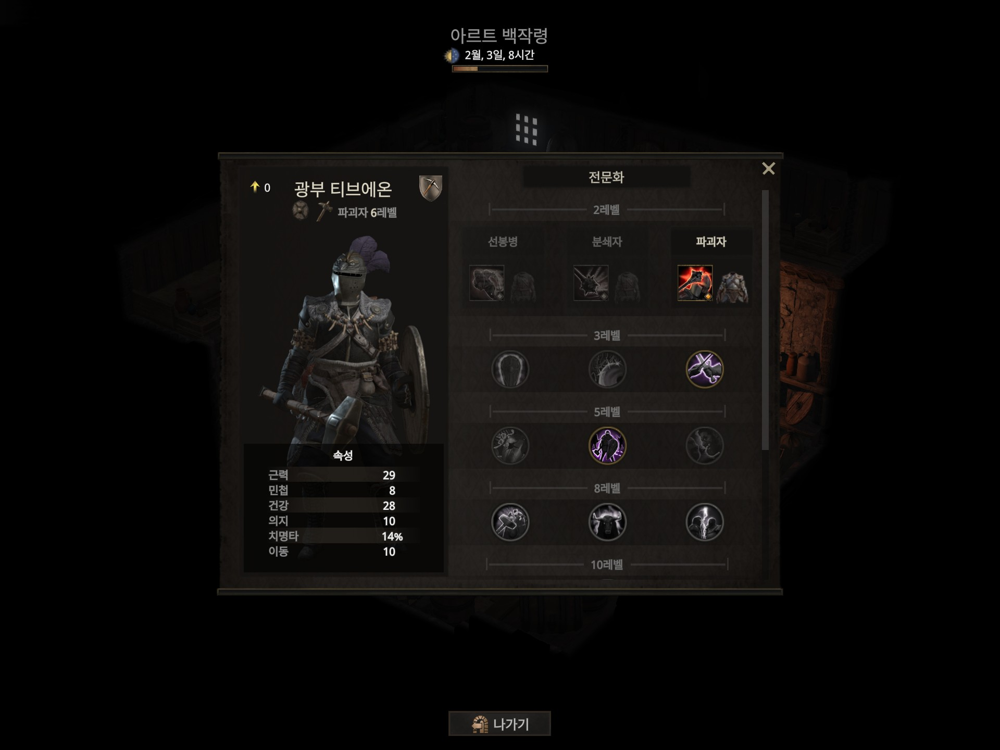
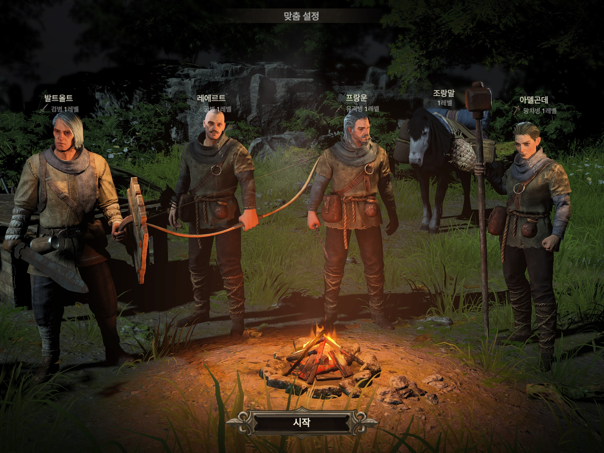

# Wartales 한국어 개선 패치

## 개요
이 프로젝트는 Wartales 게임의 한국어 번역을 개선하고, 캐릭터 이름을 한국어로 표시하는 패치를 제공합니다. 공식 한국어 번역의 자연스러운 표현 개선과 캐릭터 이름의 현지화가 주요 목표입니다.

## 다운로드 방법
GitHub 저장소 페이지에서 "Code" 버튼을 클릭하고 "Download ZIP"을 선택하여 ZIP 파일을 다운로드하세요. 다운로드한 ZIP 파일을 압축 해제하여 파일을 사용하세요.

## 1. 한국어 개선 패치

이 `export_ko.xml`과 `texts_ko.xml`은 워테일즈 공식 한국어 번역의 교정 버전으로, 자연스럽게 읽힐 수 있게끔 여러 사항을 개선하였습니다. 설치방법은 워테일즈 폴더 `res.pak` 파일이 위치한 곳에 붙여넣으면 됩니다.

아래는 한국어 개선 내용의 예시입니다. 자세한 변경 사항은 [커밋 기록](https://github.com/BoomMinho/Wartales-Korean/commits/main/)을 참고하세요.

  
## 2. 캐릭터 이름 한국어로 출력

`names.yml` 파일은 로마자로 표기되는 캐릭터 이름을 한국어로 표기되도록 합니다. 이 파일은 res.pak 파일을 언패키징하고 다시 패키징하는 작업이 필요합니다. 패키징 방법에 대한 방법은 아래 링크 글을 참고하십시오.

https://gall.dcinside.com/mgallery/board/view/?id=wartales&no=11050

아래는 캐릭터 이름이 한국어로 변경된 예시입니다.

## 3. 게임 플레이 커스텀 패치

`data.cdb` 파일은 모드 제작자의 개인적인 취향에 따라 수정된 게임 데이터 파일입니다. 대표적인 변경 사항으로는 권투가, 석궁병, 비술사가 게임 내 여관에 등장하지 않도록 한 점이 있습니다.